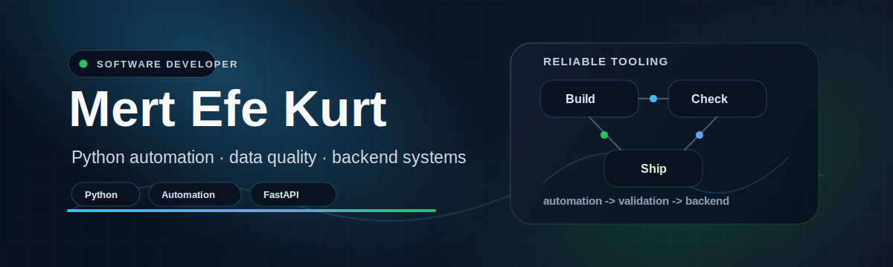

  

  
  
  

## Engineering Profile

Python-first software developer focused on automation, data quality workflows, backend APIs, and security-minded developer tools. I build practical utilities that are easy to run, easy to inspect, and simple to improve.

## Core Work

| Area | What I build |
|---|---|
| Automation | CLI tools, repeatable scripts, repository checks, and workflow helpers. |
| Data Quality | Validation, reporting, dashboard workflows, and structured log analysis. |
| Backend | FastAPI services, REST endpoints, authentication flows, and role-based access patterns. |
| Developer Tooling | Audit utilities, documentation checks, and small tools that reduce manual review work. |

## Selected Projects

| Project | What it does | Stack |
|---|---|---|
| [link-rot-scanner](https://github.com/mertefekurt/link-rot-scanner) | Scans Markdown documentation for broken links, local anchor issues, and unreachable external URLs. | Python, CLI, Markdown, HTTP |
| [log-latency-profiler](https://github.com/mertefekurt/log-latency-profiler) | Converts JSONL application logs into trace-level latency, error, and performance summaries. | Python, JSONL, Observability |
| [FAPI](https://github.com/mertefekurt/FAPI) | FastAPI authentication and role-management service with user endpoints and structured API foundations. | FastAPI, Auth, Roles, API Design |
| [PhotoEnchancer](https://github.com/mertefekurt/PhotoEnchancer) | Desktop batch image enhancement workflow with adjustable processing controls. | Python, Tkinter, Pillow, OpenCV |
| [MIS029-Chocolate-Dashboard](https://github.com/mertefekurt/MIS029-Chocolate-Dashboard) | Data visualization dashboard for analyzing chocolate bar ratings and review patterns. | HTML, Data Visualization, Dashboard |

## Toolbox

| Category | Tools and practices |
|---|---|
| Languages | Python, SQL, JavaScript, TypeScript, Java, Swift |
| Backend | FastAPI, REST APIs, authentication flows, API design |
| Automation & DevOps | Docker, GitHub Actions, Linux, CLI tooling |
| Data | Cleaning, validation, reporting, dashboards, log analysis |

## Working Style

- Clear documentation from setup to execution
- Reproducible local workflows
- Small scoped improvements with readable diffs
- Practical automation over manual repetition
- Security-minded checks for everyday development
