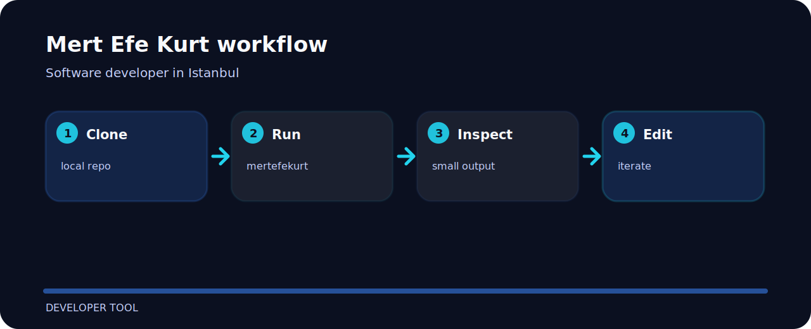

# Mert Efe Kurt

Software developer and MIS student in Istanbul. I like small tools that make hidden engineering work visible: traces, evaluations, release risk, RAG support, API behavior, and operational cleanup.

[Portfolio](https://mertefekurt.me) · [LinkedIn](https://tr.linkedin.com/in/mertefekurt) · [Repositories](https://github.com/mertefekurt?tab=repositories)

## Current lane

- local-first Python tools for review and reliability
- clear reports that fit terminal, CI, and pull request workflows
- static web work with careful layout and fast loading
- small experiments that are easy to inspect

## Start here

| Project | Why it is useful |
| --- | --- |
| [eval-delta](https://github.com/mertefekurt/eval-delta) | Compare evaluation runs without hiding regressions in averages. |
| [agent-trace-lint](https://github.com/mertefekurt/agent-trace-lint) | Review tool-call traces for loops, protocol mistakes, and risky calls. |
| [rag-citecheck](https://github.com/mertefekurt/rag-citecheck) | Check whether cited RAG answers are actually supported. |
| [mcp-probe](https://github.com/mertefekurt/mcp-probe) | Contract-test stdio MCP servers. |
