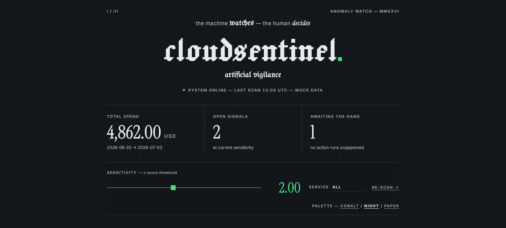

<picture>
  <source media="(max-width: 640px)" srcset="./assets/profile-hero-mobile.svg" />
  
</picture>

# Mert Efe Kurt

Software developer and Management Information Systems student in Istanbul. I build Python tools that make AI workflows easier to test: paired evaluation comparisons, agent trace linting, RAG citation checks, MCP contract tests, and reproducible API replay.

In team projects, I work across FastAPI backends, human-in-the-loop decision systems, Gemini integrations, and read-only data tooling.

[Portfolio](https://mertefekurt.me) / [LinkedIn](https://linkedin.com/in/mertefekurt) / [Email](mailto:mertk.mek@gmail.com) / [All repositories](https://github.com/mertefekurt?tab=repositories)

## GitHub, in numbers

<picture>
  <source media="(max-width: 640px)" srcset="./assets/profile-metrics-mobile.svg" />
  
</picture>

Generated weekly from the GitHub API. Forked and archived repositories are excluded from the language mix.

## Team work

### [CloudSentinel](https://github.com/muratcan-ates/cloudsentinel)

Developer in YZTA Bootcamp 2026 AI Track Group 60. I contributed five merged pull requests spanning the cost summary API, interactive dashboard and themes, CI fixes, bilingual documentation, market analysis, and UI consistency.

[Cost API, PR #1](https://github.com/muratcan-ates/cloudsentinel/pull/1) / [Dashboard, PR #4](https://github.com/muratcan-ates/cloudsentinel/pull/4) / [CI and docs, PR #5](https://github.com/muratcan-ates/cloudsentinel/pull/5) / [Market watch, PR #6](https://github.com/muratcan-ates/cloudsentinel/pull/6) / [UI consistency, PR #8](https://github.com/muratcan-ates/cloudsentinel/pull/8)

CloudSentinel night-mode dashboard, introduced in merged PR #4.

### [KOBİ Ops AI](https://github.com/emirselengil/YZTA-AI-Hackathon-Team215)

YZTA AI Hackathon Team 215 project. Across 25 commits, I built the Gemini backend layer, read-only SQLite MCP tools, model failover and quota backoff, diagnostics, tool orchestration, and query guardrail tests. The merged backend PR changed 13 files with 615 additions.

[Inspect merged PR #1](https://github.com/emirselengil/YZTA-AI-Hackathon-Team215/pull/1)

## Independent tools

### Evaluation and traces

**[eval-delta](https://github.com/mertefekurt/eval-delta)** compares paired evaluation runs by case and metadata slice, then produces seeded bootstrap confidence intervals plus terminal, JSON, and Markdown reports with CI-ready exit codes.

**[agent-trace-lint](https://github.com/mertefekurt/agent-trace-lint)** checks agent tool-call traces for protocol errors, invalid arguments, exposed secrets, risky shell operations, loops, and latency. Reports are available as text, JSON, or SARIF.

**[rag-citecheck](https://github.com/mertefekurt/rag-citecheck)** checks RAG evaluation records for missing citations, unknown sources, token overlap, and absent quoted evidence. It also emits terminal, JSON, or SARIF output.

### Protocols and test infrastructure

**[mcp-probe](https://github.com/mertefekurt/mcp-probe)** runs stdio MCP contract scenarios across schema discovery, tool calls, assertions, and latency, with JSON and JUnit reports for CI.

**[llm-replay-proxy](https://github.com/mertefekurt/llm-replay-proxy)** is a FastAPI proxy for recording and replaying non-streaming OpenAI-compatible POST calls with local JSON cassettes.

### Data visualization

**[Chocolate Ratings Dashboard](https://github.com/mertefekurt/MIS029-Chocolate-Dashboard)** explores 2,530 chocolate reviews in an R flexdashboard using ggplot2, Plotly, and DT, published with GitHub Pages.

## Toolchain

<picture>
  <source media="(max-width: 640px)" srcset="./assets/toolchain-mobile.svg" />
  
</picture>

## Contact

For project, internship, or collaboration conversations, email [mertk.mek@gmail.com](mailto:mertk.mek@gmail.com) or visit [mertefekurt.me](https://mertefekurt.me).
